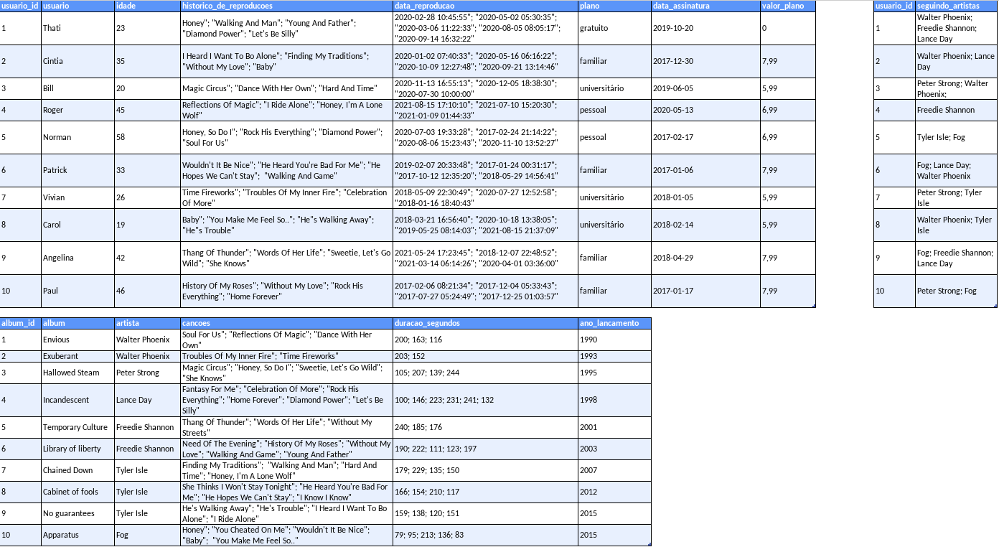

# Projeto One For All

## O que foi desenvolvido:

O projeto com o codinome ***One For All***  foi desenvolvido para a prática dos conceitos de SQL e de Normalização de Tabelas.

O projeto utilizava uma tabela não normalizada que foi normalizada na terceira forma normal e populada a partir de `queries` utilizando `SQL`.

Temos, nesse projeto, uma série de desafios com diferentes níveis de complexidade que foram resolvidos cada um em seu arquivo próprio.

O banco de dados utilizado foi o `SpotifyClone`.

### ***Importante: A tabela normalizada está no arquivo `desafio1.sql` .***
---

## 🎯 Problema resolvido:

1. Normalização da tabela, criação do schema no banco de dados local;

2. Realização dos desafios no banco normalizado e populado.

**Aviso:** Todos os dados da tabela abaixo são fictícios e foram gerados aleatoriamente através de ferramentas com o intuito de deixar o projeto mais real. Quaisquer similaridades com informações reais são meras coincidências.

**Observação:** O banco de dados real do Spotify é muito mais completo e complexo que o mostrado abaixo.

---

## Normalização das tabelas para a 3ª Forma Normal

Abaixo você pode visualizar e baixar uma planilha com as tabelas não normalizadas:

[Faça o download dela aqui](./SpotifyClone-Non-NormalizedTable.xlsx)
Como o VS Code não oferece suporte para abrir planilhas, você precisa ter algum software especifico para isso, aqui estão algumas sugestões:
- [LibreOffice Calc](https://www.libreoffice.org/download/download/) para distros Linux;
- [Numbers](https://www.apple.com/br/numbers/) Mac OS;
- Google planilhas para utilizar no browser;
-  Extensão para o VS Code como a Excel Viewer;

> Obs. Em alguns SOs já costuma vir instalado algum programa para manipular planilhas.
---

## Regras de negócio:

* Informações sobre quais planos estão disponíveis e seus detalhes;
  * Cada pessoa usuária pode possuir apenas um plano.

* Informações sobre todas as pessoas artistas;
  * Uma pessoa artista pode ter vários álbuns;
  * Uma pessoa artista pode ser seguida por várias pessoas usuárias.

* Informações sobre todos os álbuns de cada artista;
  * Para fins deste projeto, considere que cada álbum possui apenas uma pessoa artista como principal;
  * Cada álbum possui várias canções.

* Informações sobre todas as canções de cada álbum;
  * Para fins deste projeto, considere que cada canção está contida em apenas um álbum.

* Informações sobre todas as pessoas usuárias, seus planos, seu histórico de reprodução e pessoas artistas seguidas.
  * Uma pessoa usuária pode possuir apenas um plano;
  * Cada música do histórico de reprodução pode aparecer uma única vez por pessoa (para simplificar, considere que o objetivo do histórico é saber **quais** canções já foram reproduzidas e **não quantas vezes** foram reproduzidas);
  * Uma pessoa usuária pode seguir várias pessoas artistas, mas cada pessoa artista pode ser seguida apenas uma vez por pessoa usuária.

# Tecnologias utilizadas:
